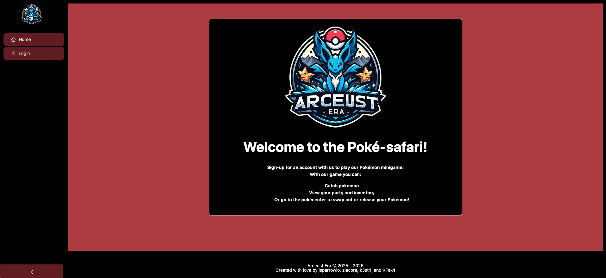

# Arceust Era

  

## Description

  Arceust Era is a browser mini-game using the Pokemon API. Walk through several areas in the Safari Zone, catch Pokemon, and set up your dream team!\

  Tech used: MERN stack used, as well as TypeScript, GraphQL/Apollo, JWT auth, the Pokemon API, Ant Design and custom CSS, and is automatically deployed on Render using GitHub Actions.

## Screenshot

  

## Table of Contents

- [Arceust Era](#arceust-era)
  - [Description](#description)
  - [Screenshot](#screenshot)
  - [Table of Contents](#table-of-contents)
  - [Installation](#installation)
  - [Usage](#usage)
  - [Credits](#credits)
  - [License](#license)
  - [How to Contribute](#how-to-contribute)
  - [Tests](#tests)
  - [Questions?](#questions)
  - [Disclaimer](#disclaimer)

## Installation

No installation required! Project is deployed on Render; simply go to the webpage [here](https://arceust-era.onrender.com/).

## Usage

Go to the webpage and sign up for a new account, then log in. Navigate to one of the Safari Zone biome pages - cave, beach, and grass - click on walk/fish/surf, and catch any pokemon that appear. Once you have more than 6 Pokemon, any caught Pokemon will go directly into your box. You can edit your team from the party page, and see all Pokemon caught from the  Pokemon Center page.

## Credits

Josh (jsparrowio):
<ul>
  <li>Admin</li>
  <li>Backend servers, typedefs, & resolvers</li>
  <li>User system (auth), login page, user settings page</li>
  <li>Render deployment</li>
  <li>Final CSS Design</li>
</ul>
Zach (zlacore):
<ul>
  <li>Concept</li>
  <li>Biome, Bag & Pokécenter pages</li>
  <li>Front end mutations</li>
</ul>
Nic (k3strl):
<ul>
  <li>Party page</li>
  <li>Front end mutations</li>
  <li>Wrote README.md</li>
</ul>
Kalana (KTek4):
<ul>
  <li>CSS Revisions</li>
  <li>Github Actions</li>
</ul>

## License

This project is licensed under the [MIT](https://opensource.org/licenses/MIT) license.\
Refer to LICENSE file for more info

## How to Contribute

No contribution needed, but feel free to fork this repo and make it your own!

## Tests

No tests implemented at this time.

## Questions?

Contact one of us on Github!
[k3strl](https://github.com/k3strl), [jsparrowio](https://github.com/jsparrowio), [zlacore](https://github.com/zlacore), [KTek4](https://github.com/KTek4).

## Disclaimer

Pokémon © 1995–2025 Nintendo/Creatures Inc./GAME FREAK Inc./The Pokemon Company Pokémon, Pokémon character names, & sprites are trademarks of Nintendo & The Pokemon Company. (Please don’t sue! 👀)
